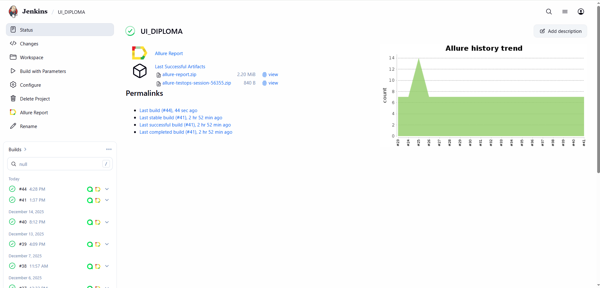
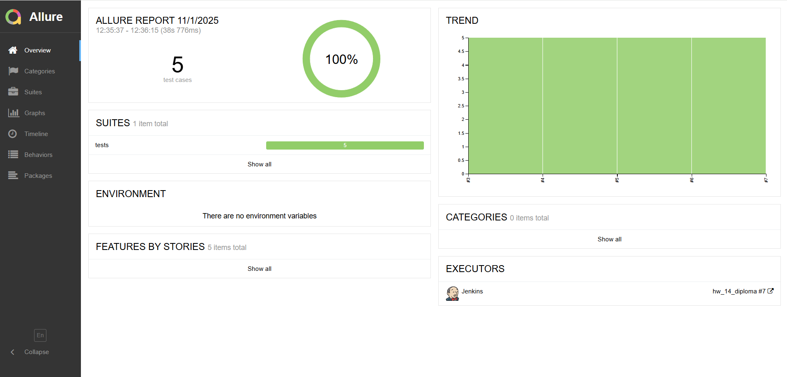
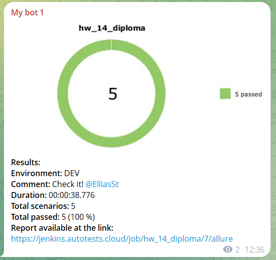

# Testing website SauceDemo
[https://www.saucedemo.com/](https://www.saucedemo.com/)

## Tech Stack


### Setup

Before running tests, you need to configure environment variables:

1. Create `.env` file in the project root
2. Add your Selenoid credentials:
```bash
SELENOID_LOGIN=user1
SELENOID_PASSWORD=1234
SELENOID_URL=selenoid.autotests.cloud
```

*The .env file is included in .gitignore to prevent accidentally committing credentials.*

### Test Run Commands

```bash
# Run all tests with Allure reporting
pytest tests/ --alluredir=allure-results -v

# Run specific test file
pytest tests/test_simple_po.py -v

# Run single test
pytest tests/test_simple_po.py::test_successful_login -v

# View Allure report
allure serve allure-results
```

## 📋 Test Scenarios

1) Successful Login - Verify user can log in with valid credentials

2) Add Item to Cart - Add specific product to cart and verify counter

3) Navigation - Open About page and verify navigation works

4) Logout - Successful user logout

5) Failed Login - Error handling for invalid credentials

### Report Examples


#### Jenkins Build


#### Allure Overview  


#### Test Details


#### Telegram Notification

